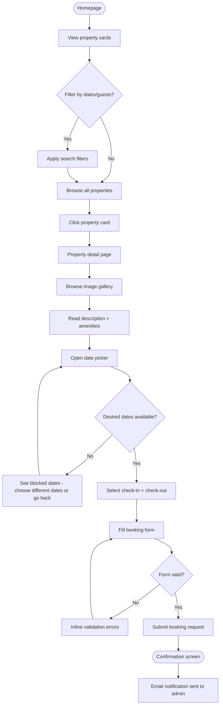
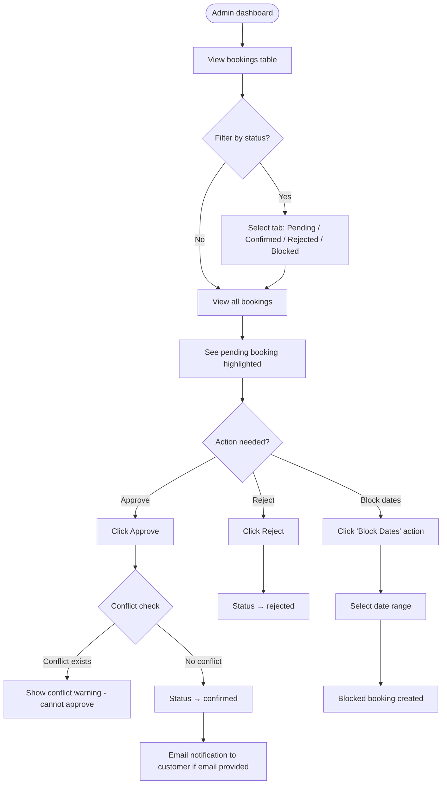
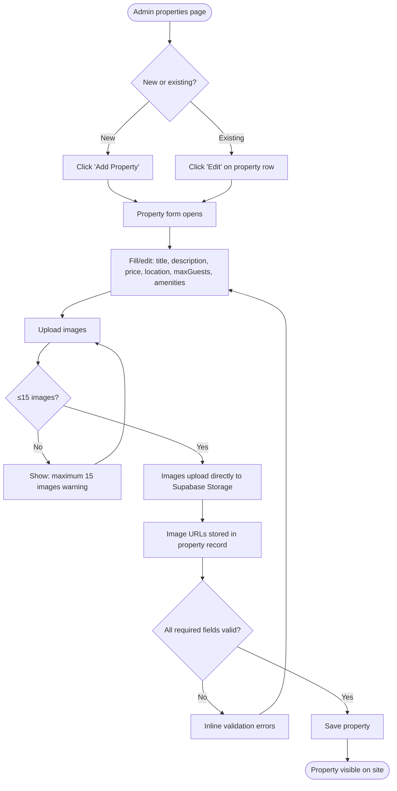
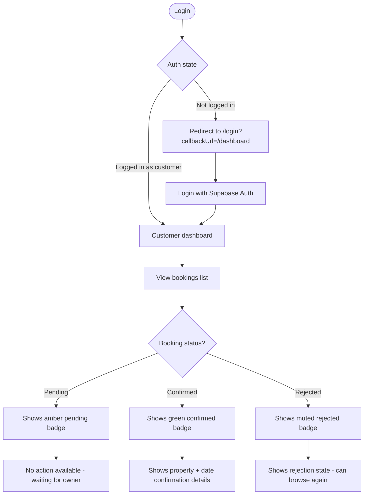

# UX Design Specification — Goodboy Holiday Homes

**Author:** Good Boy
**Date:** 2026-03-21
**Version:** 1.0

---

## Executive Summary

### Project Vision

Goodboy Holiday Homes is a boutique holiday rental platform offering 4 handpicked properties across Kerala and Tamil Nadu, India. The platform connects discerning travellers with curated nature and heritage stays — a personal, trust-driven alternative to large aggregators like Airbnb. The UX vision is: **make discovering and booking a unique South Indian holiday feel effortless, trustworthy, and evocative of the destination itself.**

The immediate context is a Supabase migration that also represents an opportunity to elevate the UI consistency and stability. No redesign — but a tightening of the existing experience with a clear component and pattern system.

### Target Users

**Primary — The Holiday Seeker (Customer)**
- Couples or families planning a 3–7 day Kerala/Tamil Nadu escape
- Age 28–55, urban professionals, India or diaspora market
- Mid-to-high disposable income, values quality over quantity
- Researches extensively; trusts curated, personal listings over faceless aggregators
- Browses on mobile (discovery) and completes booking on desktop or tablet
- Not necessarily highly technical, but comfortable with online booking

**Secondary — The Property Owner / Admin (Good Boy)**
- Single admin managing all 4 properties
- Needs efficient tools to review and approve bookings, block dates, manage listings, and handle users
- Works primarily on desktop; needs a clean, fast admin interface

### Key Design Challenges

1. **Building trust without volume** — Unlike Airbnb with thousands of reviews, Goodboy must signal quality and authenticity through visual craft, copy, and imagery alone
2. **Date selection complexity** — Blocking unavailable dates (confirmed + admin-blocked), preventing conflicts, and surfacing availability clearly without confusion
3. **Multi-image property showcase** — Up to 15 images per property; gallery UX must feel premium and load performantly from Supabase Storage CDN URLs
4. **Admin simplicity vs. power** — The admin user needs to do everything (create/edit properties, manage bookings, manage users) from a single dashboard without a complex interface
5. **Mobile discovery → desktop conversion** — Most users will first discover on mobile; the booking funnel must be touch-friendly but also excellent on desktop

### Design Opportunities

1. **Kerala/Tamil Nadu aesthetic** — Use warm earth tones, rich greens, and natural textures as color and visual language — the destination *is* the brand
2. **Framer Motion micro-interactions** — The project already includes `framer-motion`; use it for property card reveals, gallery transitions, and booking confirmation moments
3. **Instant availability feedback** — A date picker that shows availability in real-time (from Supabase) creates confidence and removes the "will this work?" anxiety
4. **Admin dashboard clarity** — A clean, well-organised admin panel is a direct competitive advantage over cobbled-together tools

---

## Core User Experience

### Defining Experience

The core user action is: **"Browse a property and book a stay."**

Everything else is support infrastructure. If a customer can land on the homepage, feel immediately inspired by what they see, filter to their dates and group size, land on a property they love, and complete a booking in under 5 minutes — the product is successful.

The equivalent Tinder moment for Goodboy is: **"See a beautiful property and instantly know it's perfect for my trip."**

### Platform Strategy

- **Primary platform:** Responsive web (Next.js App Router, Vercel-hosted)
- **Device priority:** Mobile-first for discovery (browsing, filtering, scrolling gallery); desktop/tablet optimised for booking completion (date selection, form entry)
- **Touch interactions:** React Day Picker for touch-friendly date selection; tap targets minimum 44×44px
- **No offline requirement:** Always-connected experience; no service worker needed
- **No native app:** Web-only for this phase

### Effortless Interactions

These interactions must feel zero-friction:

| Interaction | What "effortless" looks like |
|---|---|
| Property browsing | Cards load with images from Supabase CDN; `FadeIn` animation on scroll; immediate visual hierarchy |
| Date selection | Calendar opens inline; blocked dates are visually greyed out on load; no page reload needed |
| Booking form | Minimal fields (name, email optional, phone, guests, message); single-page submission |
| Admin booking approval | One-click Approve / Reject buttons visible directly in the bookings list; no modal required |
| Image upload (admin) | Drag-and-drop or click-to-select; progress indicator; immediate preview; direct-to-Supabase |

### Critical Success Moments

1. **The "I want this" moment** — A user scrolls past the hero, sees the property cards, and one image stops them
2. **The "it's available" moment** — They pick their dates and see no conflict — the calendar clears and they feel confident
3. **The "I booked it" moment** — Confirmation state is warm and explicit: "Your booking request is submitted — Good Boy will confirm within 24h"
4. **The admin "all under control" moment** — Admin sees the bookings table sorted by status; pending ones are obvious; two clicks to approve

### Experience Principles

1. **Destination-first** — Every visual decision should evoke Kerala/Tamil Nadu: lush, warm, unhurried
2. **Clarity over cleverness** — Navigation, CTAs, and forms must be immediately understood — no UX puzzles
3. **Progressive trust building** — Each scroll, each interaction reinforces legitimacy: real images, transparent pricing, no hidden steps
4. **Admin efficiency** — Admin paths should be 1–2 clicks deep; no hunting for actions
5. **Mobile-tolerant, desktop-optimised** — Discovery works on mobile; booking is designed for larger screens

---

## Desired Emotional Response

### Primary Emotional Goals

**For customers:** The dominant emotion should be **anticipation and desire** — the same feeling you get when flipping through a travel magazine and circling something. When they arrive at a property page, they should feel: *"I want to be there."*

**For admin:** The dominant emotion should be **calm control** — everything is visible, nothing is confusing. *"I can see everything I need to run this."*

### Emotional Journey Mapping

| Stage | Customer Emotion | Design Response |
|---|---|---|
| Homepage arrival | Curious, slightly sceptical ("Is this legit?") | Hero image + property count + social proof copy |
| Browsing properties | Exploratory, growing interest | Beautiful cards, clear info hierarchy, hover reveals |
| Property detail page | Desire, consideration | Full-bleed gallery, all amenities visible, price prominent |
| Date selection | Mild anxiety ("Is it available?") | Instant calendar; confirmed dates clearly blocked |
| Booking form | Cautious commitment | Minimal friction, clear what happens next |
| Booking submitted | Anticipation, slight uncertainty | Warm confirmation screen, explicit next-step messaging |
| Admin: new booking arrives | Responsibility, efficiency | Clear notification-style highlight; one-click actions |
| Admin: booking confirmed | Satisfaction | Success state, booking moves to confirmed tab |

### Micro-Emotions

**Build these:**
- **Confidence** — Users know what they're doing at every step; no ambiguity
- **Trust** — The platform feels professional, cared-for, real
- **Excitement** — Arrival at a property page should feel like opening a brochure
- **Accomplishment** — Booking submission feels like a real achievement, not an anxiety spike

**Eliminate these:**
- **Confusion** — Navigation, CTAs, and form labels must be unambiguous
- **Doubt** — Never leave users wondering if their booking went through or what happens next
- **Frustration** — Date conflicts, form errors, and loading states are handled gracefully

### Design Implications

| Target Emotion | UX/Design Approach |
|---|---|
| Desire | Full-bleed hero images, generous image galleries, warm copy tone |
| Trust | Consistent UI patterns, professional typography, no broken images (Supabase CDN solves this) |
| Confidence | Clear CTAs, progress indicators, inline validation on forms |
| Calm control (admin) | Table-based data layout, colour-coded status badges, minimal modal usage |
| Accomplishment | Animated confirmation screen with Framer Motion; explicit "what happens next" messaging |

### Emotional Design Principles

1. **Show, don't tell** — Images do the emotional work; copy supports
2. **Reduce uncertainty at every handoff** — Every step has a clear "what happens next"
3. **Errors are not failures** — Validation errors are friendly, specific, and immediately actionable
4. **Delight lives in the transitions** — Framer Motion entry animations on property cards, gallery slides, and confirmation screens

---

## UX Pattern Analysis & Inspiration

### Inspiring Products Analysis

**Airbnb** — The gold standard for property browsing UX
- What they do well: Immersive image-first property cards, date picker integrated into search, strong information hierarchy on property pages, guest/host trust signals
- Transferable: Card layout with primary image dominant; date range picker in search; property stats (guests, beds, baths) in card subtitle

**Booking.com** — Conversion-optimised booking funnel
- What they do well: Urgency signals (X people viewing), availability calendars with live data, clear pricing
- Transferable: Prominent availability calendar on property page; clear booking CTA above the fold; price per night + total calculation

**Linear** (project management) — Admin dashboard clarity
- What they do well: Dense but organised data tables, colour-coded status chips, keyboard-friendly
- Transferable: Admin bookings table pattern with status badges (`pending` = amber, `confirmed` = green, `rejected` = red/muted); row actions visible on hover

**Calm / Headspace** — Emotional onboarding
- What they do well: Destination-before-function; first impression is emotional, not functional
- Transferable: Homepage hero prioritises feeling over features; no feature list above the fold

### Transferable UX Patterns

**Navigation Patterns:**
- Persistent top navbar with logo, main nav links, auth state (from existing Navbar component)
- Mobile: hamburger menu or bottom-aligned sticky nav for booking CTA
- Admin: left sidebar navigation for desktop; full-width stacked for mobile

**Property Card Pattern:**
- Primary image fills ~60% of card
- Property name, location, and price per night in card body
- Max guests indicator
- On hover: subtle lift shadow + "View Property" CTA reveal (Framer Motion)

**Calendar Pattern:**
- React Day Picker in "range" mode for check-in / check-out
- Blocked dates visually greyed out with strikethrough styling
- Selected range highlighted in brand primary colour
- Mobile: single-column month, touch-friendly date cells

**Booking Form Pattern:**
- Single-page (no multi-step) for a 4-property boutique — don't over-engineer
- Fields: Name, Email (optional), Phone, Guests, Special Requests
- Submit button full-width on mobile

### Anti-Patterns to Avoid

1. **Forced account creation before browsing** — Customers can browse and enquire without registering (current behaviour preserved)
2. **Mandatory fields without reason** — Email is optional for phone-only bookings (as per existing business logic)
3. **Pagination on a 4-property site** — All properties visible at once with optional filter; no page 2
4. **Admin features visible to customers** — Role-based routing already in middleware; enforce in UI too (no admin links in customer nav)
5. **Loading spinners for critical content** — Use skeleton loaders or SSR data for property cards to avoid layout shift
6. **Confirmation modals for everything** — One-click approve/reject for bookings; reserve confirmation dialogs for destructive actions only (delete)

### Design Inspiration Strategy

**Adopt:**
- Airbnb's image-first card layout for property listings
- Booking.com's inline availability calendar on the property page
- Linear's status badge colour coding for the admin bookings table

**Adapt:**
- Airbnb's multi-step booking → simplify to single-page form (4 properties, boutique context)
- Linear's sidebar nav → lighter version (no left rail, tab-based admin nav)

**Avoid:**
- Airbnb's review/star system (not in scope)
- Booking.com's urgency dark patterns ("Only 1 room left!")
- Any OAuth/social login UI (deferred post-migration)

---

## Design System Foundation

### Design System Choice

**Shadcn/ui — new-york style** with Tailwind CSS v4

This is the existing design system in the codebase. All UI primitives live in `components/ui/`. This document codifies how to use it consistently, not change it.

### Rationale for Selection

- **Already implemented** — `components/ui/` contains Button, Card, Dialog, Input, Label, Badge, Calendar, Select, Textarea, Table, Tabs, Dropdown, Avatar, and more (new-york variant)
- **CSS variables for theming** — Semantic color tokens (`bg-background`, `text-foreground`, `text-muted-foreground`, `bg-muted`, `bg-primary`, etc.) allow theme changes without component edits
- **RSC-compatible** — Server Component safe; `"use client"` added only for interactive primitives
- **Tailwind v4 compatible** — `@import "tailwindcss"` in globals.css; all utility classes work as expected
- **Accessibility built-in** — Radix UI primitives under the hood; keyboard navigation, ARIA attributes, focus trapping

### Implementation Approach

- **Do NOT modify** files in `components/ui/` directly — these are shadcn-managed
- **All custom components** are built in `components/` using shadcn primitives + `cn()` utility
- **Admin components** live in `components/admin/`; shared page-level components in `components/`
- **CSS variables** — use semantic tokens, never raw Tailwind colour names (e.g. `bg-primary` not `bg-green-700`)

### Customization Strategy

The existing Shadcn new-york theme is customised via CSS variables in `app/globals.css`. For the Supabase migration and beyond, the colour system should evoke Kerala/Tamil Nadu:

- **Primary:** A deep forest green (Kerala backwaters / tea plantation palette)
- **Accent:** Warm amber/turmeric (Indian spice market warmth)
- **Background:** Warm off-white / cream (not stark white)
- **Destructive:** Standard red, used sparingly

These values are set in `globals.css` `:root` CSS variables — no component changes needed.

---

## 2. Core User Experience

### 2.1 Defining Experience

**"Browse a stunning South Indian property and book it in under 5 minutes."**

Like Spotify's "play any song instantly" — the defining experience is frictionless discovery to commitment. The customer should never feel like they're filling out a form. They should feel like they're choosing an experience.

The interaction flow:
1. **Homepage hero** draws them in emotionally
2. **Property cards** do the selection work visually
3. **Property detail page** converts desire to intent
4. **Date picker + booking form** converts intent to action
5. **Confirmation screen** converts action to anticipation

### 2.2 User Mental Model

Customers approach this like planning any holiday:
- They already know roughly when they want to go and how many people
- They want to see what they're getting before they commit
- They expect availability to be real-time accurate
- They understand that a pending booking needs owner confirmation (this is normal for boutique rentals)

**What they love about boutique rentals:** Personal touch, fewer hoops, owner who cares
**What frustrates them:** Unclear availability, hidden pricing, too many steps to book

**The gap Goodboy fills:** Airbnb feels corporate and commission-heavy; Goodboy feels like booking directly with the owner

### 2.3 Success Criteria

The core experience succeeds when:
- A new visitor can reach the booking submission screen within 3–5 page interactions
- No customer needs to ask "is this available?" — the calendar answers it
- No customer wonders "did my booking go through?" — the confirmation screen is unambiguous
- An admin can approve a booking within 30 seconds of receiving a notification

### 2.4 Novel UX Patterns

The booking flow uses **established patterns** — no novel interactions needed. The value is in execution quality, not innovation:
- Standard date range picker (React Day Picker) — users already understand this
- Standard booking form — familiar from hotel booking context
- Standard admin table with status management — familiar from any CMS

The **only novel element** is the direct Supabase Storage image gallery — images persist across deploys, served from CDN. This is transparent to users but solves the broken-image problem entirely.

### 2.5 Experience Mechanics

**Booking Flow Mechanics:**

1. **Initiation:** User lands on property page → "Book Now" CTA or date picker visible in sticky sidebar (desktop) / below gallery (mobile)

2. **Date Selection:**
   - Calendar shows current month
   - Admin-blocked and confirmed-booked dates are greyed out on load (fetched via Supabase query)
   - User selects check-in → calendar highlights; then selects check-out → range highlighted
   - Nights count and total price update dynamically

3. **Form Entry:**
   - Fields: Full Name (required), Email (optional), Phone (required), Number of Guests (required, max enforced), Special Requests (optional textarea)
   - Inline validation: phone format, guest count within property limit, date range not empty

4. **Submission:**
   - Button: "Request Booking" (not "Book Now" — sets expectation of pending state)
   - On success: animated confirmation panel with booking summary and "What happens next" explainer
   - On error: inline error message with specific guidance (e.g. "These dates are no longer available")

5. **Completion signal:** "Your booking request has been submitted. Good Boy will confirm your stay within 24 hours. You'll be notified by email." (if email provided)

---

## Visual Design Foundation

### Color System

The color system is implemented via CSS variables in `globals.css` using Shadcn's semantic token naming. The palette evokes the Kerala/Tamil Nadu landscape:

**Light Mode Tokens:**

| Token | Value | Usage |
|---|---|---|
| `--background` | `hsl(40 20% 97%)` | Warm cream page background |
| `--foreground` | `hsl(20 10% 15%)` | Near-black text |
| `--primary` | `hsl(152 35% 28%)` | Deep forest green — CTAs, links, focus rings |
| `--primary-foreground` | `hsl(40 20% 97%)` | Text on primary background |
| `--secondary` | `hsl(40 20% 92%)` | Warm neutral — secondary buttons, chips |
| `--secondary-foreground` | `hsl(20 10% 25%)` | Text on secondary |
| `--accent` | `hsl(32 80% 55%)` | Warm amber — highlights, hover states |
| `--muted` | `hsl(40 15% 93%)` | Subtle backgrounds for cards, tables |
| `--muted-foreground` | `hsl(20 8% 50%)` | Secondary text, placeholders |
| `--destructive` | `hsl(0 72% 51%)` | Error states, delete actions |
| `--border` | `hsl(40 12% 88%)` | Card borders, dividers |
| `--ring` | `hsl(152 35% 28%)` | Focus rings (matches primary) |

**Status Badge Colors (admin use):**

| Status | Background | Text |
|---|---|---|
| `pending` | `hsl(38 90% 90%)` | `hsl(38 80% 35%)` — amber |
| `confirmed` | `hsl(142 50% 88%)` | `hsl(142 50% 30%)` — green |
| `rejected` | `hsl(0 50% 92%)` | `hsl(0 55% 40%)` — muted red |
| `blocked` | `hsl(220 12% 90%)` | `hsl(220 10% 40%)` — grey |

**Accessibility:** All text/background combinations meet WCAG AA (4.5:1 for normal text, 3:1 for large text). Primary green on cream background passes at all text sizes.

### Typography System

The existing font stack (Geist Sans + Geist Mono) is preserved:

```css
/* Already in app/layout.tsx */
--font-geist-sans: 'Geist', sans-serif;
--font-geist-mono: 'Geist Mono', monospace;
```

**Type Scale:**

| Role | Class | Size | Weight | Line Height |
|---|---|---|---|---|
| Hero headline | `text-5xl md:text-7xl font-bold` | 48–72px | 700 | 1.1 |
| Page title | `text-3xl md:text-4xl font-semibold` | 30–36px | 600 | 1.2 |
| Section heading | `text-2xl font-semibold` | 24px | 600 | 1.3 |
| Card title | `text-lg font-semibold` | 18px | 600 | 1.4 |
| Body text | `text-base` | 16px | 400 | 1.6 |
| Small / captions | `text-sm text-muted-foreground` | 14px | 400 | 1.5 |
| Labels / badges | `text-xs font-medium` | 12px | 500 | 1.4 |

**Principles:**
- **Geist Sans** for all UI text — no other fonts introduced
- **Geist Mono** for code, booking references, or price display where mono spacing aids reading
- Line length: max 65–75 characters for body copy (use `max-w-prose`)
- No italic for UI elements — italic reserved for pull quotes or property descriptions only

### Spacing & Layout Foundation

**Base unit:** 4px (Tailwind's default `rem/4` scale — `spacing-1 = 4px`)

**Key spacing decisions:**

| Context | Spacing |
|---|---|
| Section padding (vertical) | `py-16 md:py-24` |
| Card padding | `p-4 md:p-6` |
| Form field gap | `space-y-4` |
| Navbar height | `h-16` (64px) |
| Grid gap (property cards) | `gap-6 md:gap-8` |
| Inline icon + text gap | `gap-2` |

**Layout grid:**
- Homepage / properties: `grid-cols-1 sm:grid-cols-2 lg:grid-cols-3` for property cards
- Property detail: sidebar layout on desktop (`lg:grid-cols-[1fr_360px]`); stacked on mobile
- Admin: full-width tables on all sizes; data density over whitespace

**Max widths:**
- Site content: `max-w-7xl mx-auto px-4 sm:px-6 lg:px-8`
- Reading content (descriptions): `max-w-prose`
- Booking form: `max-w-lg`

### Accessibility Considerations

- **WCAG AA** compliance target for all customer-facing pages
- Minimum contrast ratios enforced via CSS variable system (audited above)
- All interactive elements have visible focus rings (`ring-2 ring-ring ring-offset-2`)
- Minimum touch target size: 44×44px (enforced for mobile date picker cells and action buttons)
- All images include descriptive `alt` text; decorative images use `alt=""`
- Form fields associated with labels via `htmlFor` / `id` pairs
- Shadcn Radix UI primitives provide ARIA attributes and keyboard nav automatically

---

## Design Direction Decision

### Design Directions Explored

Given the existing "vibecoded" codebase, four directions were evaluated:

1. **Minimal Refresh** — Keep existing structure, add colour system and spacing consistency
2. **Destination Immersive** — Full-bleed imagery, editorial layout, scroll-driven animations
3. **Clean Hospitality** — Booking.com-style functional clarity with warm accents
4. **Boutique Magazine** — Grid editorial with strong typography, minimal imagery per card

### Chosen Direction

**Direction 3: Clean Hospitality with Destination Warmth**

A hybrid: the functional clarity and booking confidence of a hospitality platform (Booking.com information hierarchy) combined with the warm destination aesthetic (Kerala palette, generous imagery).

This is the natural evolution of the existing codebase — not a rebuild. The Shadcn new-york components already provide clean hospitality-grade UI. The customisation is in colour, imagery quality (Supabase CDN removes broken images), and consistent spacing.

### Design Rationale

- **Pragmatic:** Respects the brownfield constraint — no redesign, just consistency and colour
- **Trust-building:** Clean hospitality UI signals professionalism without corporate coldness
- **Conversion-focused:** Information hierarchy (image → name → price → CTA) proven in booking context
- **Distinctively Indian:** The green/amber/cream palette is immediately evocative of South India without being kitschy
- **Framer Motion compatible:** FadeIn animations on cards and page transitions work perfectly with this direction

### Implementation Approach

1. Update `globals.css` CSS variables to Kerala colour palette (as defined in Visual Foundation)
2. Apply consistent spacing scale across all page components
3. Standardise property card layout using Card + CardContent from shadcn
4. Add skeleton loading states for property cards
5. Implement `FadeIn` wrapper from `@/components/animations` on property card grids
6. Add Framer Motion to booking confirmation screen

---

## User Journey Flows

### Journey 1: Customer Books a Property



**Key UX decisions:**
- Date picker loads blocked dates from Supabase on page load (SSR or immediate client fetch)
- Confirmation screen shows: booking ID (if applicable), property name, dates, guests, "what happens next" copy
- Email is optional — confirmation screen works regardless of email provision

### Journey 2: Admin Manages Bookings



**Key UX decisions:**
- Conflict check happens server-side via Supabase `check_booking_conflict()` function
- Approve/Reject are inline row actions — no navigation to detail page required for standard cases
- Status change is immediate with optimistic UI update

### Journey 3: Admin Creates / Edits a Property



**Key UX decisions:**
- Image upload goes directly from browser to Supabase Storage (no server proxy)
- 15-image limit enforced in `PropertyForm` component before upload attempt
- Images appear as thumbnails immediately after upload (optimistic preview from Supabase Storage URL)

### Journey 4: Customer Views Their Bookings



### Journey Patterns

**Navigation patterns:**
- Authenticated routes always check Supabase session in middleware; redirect to `/login?callbackUrl=` if missing
- Admin routes (`/admin/*`) additionally check `profiles.role === 'admin'`; redirect to `/` if customer tries to access
- All redirects preserve the intended destination via `callbackUrl`

**Feedback patterns:**
- Status changes (booking approve/reject) show toast notification via shadcn `Toast`
- Form submissions show inline loading state on button (`disabled` + spinner icon)
- Upload progress shown via shadcn `Progress` bar during Supabase Storage upload

**Error patterns:**
- 404 for missing properties: `notFound()` from `next/navigation`
- API errors: inline error message in form, never a full-page error
- Booking conflicts: specific error copy "These dates are already taken — please choose different dates"
- Auth errors: redirect to login with toast "Please log in to continue"

### Flow Optimization Principles

1. **Reduce steps to value** — Property detail page has all information above the fold or one scroll away; no tabs hiding key info
2. **Front-load confidence** — Blocked dates visible immediately on calendar load; price per night always visible on property cards
3. **Error recovery is one step** — Every validation error message tells the user exactly what to fix
4. **Admin bulk actions deferred** — Not in scope; admin manages 4 properties manually; no bulk approval needed

---

## Component Strategy

### Design System Components

Shadcn/ui new-york components already installed and in use:

| Component | Used For |
|---|---|
| `Button` | All CTAs, form submissions, admin actions |
| `Card` + `CardContent` + `CardHeader` | Property cards, admin data cards |
| `Dialog` | Confirmation dialogs (delete user, delete property) |
| `Input` | All text inputs in booking form, property form, login |
| `Label` | Form field labels |
| `Badge` | Booking status chips, property amenity tags |
| `Calendar` | Date range selection via React Day Picker |
| `Select` | Guest count selector, filter selectors |
| `Textarea` | Special requests field, property description |
| `Table` + `TableRow` etc. | Admin bookings table, users table |
| `Tabs` | Admin dashboard section navigation |
| `Toast` | Success/error notifications |
| `Avatar` | User avatars in admin users table |
| `Separator` | Section dividers |
| `Skeleton` | Loading states for property cards |
| `Progress` | Image upload progress |

### Custom Components

These components don't exist in shadcn and need to be built:

#### `PropertyCard`

**Purpose:** Displays a single property in the browsing grid
**File:** `components/property-card.tsx`
**Anatomy:**
- Top: `next/image` with `aspect-ratio: 4/3`, object-fit cover
- Bottom: property name (CardTitle), location (muted), price/night (bold), max guests (icon + count)
- Hover state: subtle box shadow lift, "View Property" CTA reveal
- Interaction: entire card is clickable → `/properties/[id]`

**States:**
- Default: image + info
- Hover: shadow lift + CTA overlay (Framer Motion `whileHover`)
- Loading: Skeleton of same dimensions

#### `PropertyGallery`

**Purpose:** Full-screen image gallery on property detail page
**File:** `components/property-gallery.tsx`
**Anatomy:**
- Primary image: large, full-width on mobile; grid layout on desktop (1 large + 4 thumbnails)
- "View all X photos" button opens a lightbox dialog
- Lightbox: full-screen Dialog with prev/next navigation (keyboard + touch swipe)

**States:**
- Default: grid view
- Lightbox open: Dialog with full-size image + arrows
- Image loading: blur placeholder from Supabase Storage

#### `BookingCalendar`

**Purpose:** Date range picker showing availability for a specific property
**File:** `components/booking-calendar.tsx`
**Anatomy:**
- Wraps React Day Picker in range mode
- `disabled` prop populated with: confirmed booking date ranges + admin-blocked ranges
- Inline legend: green = available, grey = unavailable
- Night count badge updates as range is selected

**States:**
- Default: current month, no selection
- Selecting: first date selected, hover highlights range
- Selected: range highlighted in primary colour
- Disabled dates: greyed out, not selectable

#### `BookingForm`

**Purpose:** Collects customer details and submits booking
**File:** `components/booking-form.tsx` (already exists — to be updated)
**Updates needed:**
- Remove dependency on `/api/bookings` for auth check (use Supabase session check)
- Add inline validation with clear error messages
- Confirmation success state with Framer Motion animation

#### `AdminBookingRow`

**Purpose:** Single row in admin bookings table with inline actions
**File:** `components/admin/booking-row.tsx`
**Anatomy:**
- Columns: Property, Customer name, Dates, Guests, Status badge, Actions
- Actions: `Approve` (green Button variant) | `Reject` (destructive variant) — hidden if already confirmed/rejected
- Status badge uses semantic colour from status badge table above

#### `ImageUploader`

**Purpose:** Multi-image upload to Supabase Storage with preview
**File:** `components/admin/image-uploader.tsx`
**Anatomy:**
- Drop zone: dashed border, "Drag images here or click to select"
- Accepts: jpeg, png, webp; max 5MB per image
- Progress bar per file during upload
- Preview grid of uploaded images with "remove" X button
- Shows count: "X / 15 images"

### Component Implementation Strategy

All custom components:
- Use shadcn primitives (`Button`, `Dialog`, `Card` etc.) for atomic UI elements
- Use `cn()` from `@/lib/utils` for all class merging
- Typed with explicit TypeScript interfaces — no `any`
- Marked `"use client"` only when using hooks or event handlers
- Follow kebab-case file naming, PascalCase export naming

### Implementation Roadmap

**Phase 1 — Critical path (unblocked by Supabase migration):**
- `BookingCalendar` — blocks booking flow
- `ImageUploader` — blocks property creation

**Phase 2 — Core experience:**
- `PropertyCard` — improves browsing UX
- `PropertyGallery` — improves property page UX

**Phase 3 — Admin efficiency:**
- `AdminBookingRow` — improves booking management speed

**Phase 4 — Polish:**
- Skeleton loading states for property cards
- Framer Motion animations on confirmation screen

---

## UX Consistency Patterns

### Button Hierarchy

| Variant | Usage | Shadcn Variant |
|---|---|---|
| Primary action | "Book Now", "Save Property", "Approve" | `default` |
| Secondary action | "View Property", "Edit", "Cancel" | `outline` |
| Destructive | "Delete", "Reject" | `destructive` |
| Ghost | Navbar links, subtle actions | `ghost` |
| Link-style | In-text CTAs | `link` |

**Rules:**
- Maximum one primary CTA per screen section
- Destructive actions always require confirmation dialog (Delete); approval-style actions (Reject booking) do not — they are reversible by re-approving
- Loading state: disable button + show spinner icon + change text to verb+ing ("Saving...", "Booking...")
- Button width: inline for desktop; full-width (`w-full`) on mobile for primary CTAs

### Feedback Patterns

**Toast notifications** (shadcn Toast) — used for async actions:
- Success: green left border, "Booking confirmed" / "Property saved"
- Error: red left border, specific error message
- Duration: 4 seconds auto-dismiss; user can dismiss early

**Inline validation** — used for form fields:
- Show error below the field in `text-sm text-destructive`
- Show only after first submission attempt or on blur
- Never show all errors at once before user has interacted

**Loading states:**
- Full-page data load: Skeleton components matching content shape
- Button action: disabled + spinner (lucide `Loader2` with `animate-spin`)
- Image upload: Progress bar per file

**Empty states:**
- Admin bookings table with no bookings: centered illustration + "No bookings yet. Share your properties!"
- Customer dashboard with no bookings: "You haven't made any bookings yet. Browse properties →"
- Properties page with no results from filter: "No properties match your search. Try adjusting your dates or guest count."

### Form Patterns

**Consistent form anatomy:**
```
[Label]
[Input / Textarea / Select]
[Helper text — muted, small]
[Error text — destructive, small — only on error]
```

**Required vs. optional:**
- Required fields: no asterisk (all fields assumed required unless marked)
- Optional fields: `(optional)` label in muted text after the label

**Date inputs:**
- Always use `BookingCalendar` for date range — never raw `<input type="date">`
- Date format displayed: `DD MMM YYYY` (e.g. 15 Apr 2026) — use `date-fns` `format(date, 'd MMM yyyy')`

**Number inputs (guests):**
- Use shadcn `Select` or stepper pattern — never raw `<input type="number">`
- Min: 1, Max: property's `maxGuests` value

### Navigation Patterns

**Top Navbar (all pages):**
- Logo left, main nav links centre, auth right
- Auth state: logged out → "Login" button; logged in → user name + role-appropriate links + logout
- Mobile: hamburger menu opening a sheet (shadcn Sheet component)
- Active link: primary colour underline or background highlight

**Admin navigation:**
- Tab-based navigation within `/admin` (Properties, Bookings, Users)
- Current tab: primary colour indicator
- No left sidebar — tabs are sufficient for 3 admin sections

**Breadcrumbs:**
- Property detail page: Home > Properties > [Property Name]
- Admin sections: Admin > [Section Name]
- Use shadcn `Breadcrumb` component

**Back navigation:**
- Always available on detail pages; uses `router.back()` or explicit link to parent

### Additional Patterns

**Status Badges:**
- Always use shadcn `Badge` with custom variant classes
- Colour coding consistent with status badge table in Visual Foundation
- Never use colour alone to communicate status — always include text label

**Image handling:**
- All images use `next/image`
- Remote images from Supabase Storage domain added to `next.config.ts` `remotePatterns`
- All images have `alt` text describing the content
- Broken image fallback: a placeholder with the property name

**Confirmation dialogs (destructive actions only):**
- Use shadcn `AlertDialog` (not `Dialog`) for destructive confirmations
- Title: "Are you sure?" — Body: specific consequence — Actions: "Cancel" (outline) + "Delete" (destructive)

**Price display:**
- Format: `₹ X,XXX / night` using `toLocaleString('en-IN')`
- Total price in booking summary: `₹ X,XXX × N nights = ₹ X,XXX`

---

## Responsive Design & Accessibility

### Responsive Strategy

**Mobile (< 768px) — Discovery-first:**
- Single column property grid
- Full-width property cards with 16:9 image aspect ratio
- Stacked property detail layout: gallery → info → booking form
- Bottom-sticky "Book Now" CTA bar on property detail page (scrolls away once form is visible)
- Touch-optimised date picker (large touch targets, single month view)

**Tablet (768px – 1023px) — Intermediate:**
- 2-column property grid
- Property detail: gallery above, info + booking form side by side
- Admin tables: all columns visible but condensed

**Desktop (≥ 1024px) — Conversion-optimised:**
- 3-column property grid
- Property detail: sidebar layout (`grid-cols-[1fr_360px]`) with sticky booking sidebar
- Admin tables: full column set with row hover actions visible

### Breakpoint Strategy

Tailwind CSS v4 breakpoints (mobile-first):

| Breakpoint | Min Width | Usage |
|---|---|---|
| (default) | 0px | Mobile single-column layout |
| `sm:` | 640px | 2-col property grid begins |
| `md:` | 768px | Navigation expands; tablet-optimised layouts |
| `lg:` | 1024px | 3-col grid; desktop sidebar layout |
| `xl:` | 1280px | Max content width reached; extra whitespace |

**Mobile-first approach** — all base styles are mobile; `md:` and `lg:` prefixes add desktop enhancements.

**Critical breakpoints for this project:**
- `md:` — Navbar hamburger → full link bar transition
- `lg:` — Property detail stacked → sidebar layout transition
- `lg:` — Admin table shows all columns

### Accessibility Strategy

**Target: WCAG 2.1 Level AA**

This is the industry standard and appropriate for a customer-facing booking platform. Full AAA is not required (no legal mandate in current context), but AA ensures the site is usable by people with visual impairments, motor disabilities, and cognitive differences.

**Key requirements:**

| Category | Requirement | Implementation |
|---|---|---|
| Colour contrast | 4.5:1 for normal text, 3:1 for large text | CSS variable palette validated above |
| Keyboard navigation | All interactive elements reachable and operable via keyboard | Shadcn Radix primitives provide this; verify custom components |
| Focus indicators | Visible focus ring on all interactive elements | `ring-2 ring-ring ring-offset-2` on all shadcn primitives |
| Touch targets | Min 44×44px | Enforce in mobile CSS; date picker cells, buttons, nav links |
| Screen reader | All images have alt text; forms have labels; status is announced | `alt` on all `next/image`; shadcn form patterns; Toast uses `role="alert"` |
| Skip links | "Skip to main content" link at top of page | Add `<a href="#main-content" className="sr-only focus:not-sr-only">` to layout |
| Semantic HTML | Correct use of headings, landmarks, lists | Enforce in page structure; h1 per page, landmark regions |
| Error identification | Errors are identified in text, not colour alone | Error messages below fields (text + destructive colour) |

### Testing Strategy

**Responsive testing:**
- Verify at actual breakpoints: 375px (iPhone), 768px (iPad), 1280px (laptop), 1440px (desktop)
- Test booking calendar on mobile touch (React Day Picker range selection)
- Test image gallery lightbox on mobile (swipe vs. tap navigation)

**Accessibility testing:**
- Run Lighthouse accessibility audit on homepage, property page, and booking form
- Keyboard-only navigation test: tab through entire booking flow without mouse
- Verify all form errors are announced by screen reader (VoiceOver on macOS as proxy)
- Verify date picker is keyboard navigable

### Implementation Guidelines

**Responsive development:**
- Use Tailwind responsive prefixes (`md:`, `lg:`) — never inline media queries in component files
- Use `aspect-ratio` utilities for image containers to prevent layout shift (`aspect-video`, `aspect-square`)
- Use `container` + `mx-auto` for consistent page gutters
- Test with actual mobile device or Chrome DevTools device emulation for touch interactions

**Accessibility development:**
- Add `aria-label` to icon-only buttons (e.g. gallery close button, hamburger menu)
- Ensure `<Dialog>` and `<AlertDialog>` trap focus correctly (Radix handles this)
- Add `role="status"` to dynamic regions that update (booking confirmation, availability messages)
- Use `useReducedMotion` from framer-motion to respect `prefers-reduced-motion` on all animations:
  ```tsx
  import { useReducedMotion } from 'framer-motion';
  const shouldReduceMotion = useReducedMotion();
  // Pass shouldReduceMotion to animation variants
  ```

---

## Workflow Complete

**UX Design Specification Status:** Complete

All 14 workflow steps have been executed. This document provides:

1. A shared understanding of who the product is for and what they need emotionally and functionally
2. A clear design system foundation (Shadcn/ui new-york, Kerala colour palette, Geist typography)
3. A defining experience statement and mechanics for the core booking flow
4. Detailed user journey Mermaid diagrams for all critical paths
5. A component strategy with specifications for all custom components needed
6. UX consistency patterns for buttons, forms, feedback, and navigation
7. Responsive and accessibility strategy with WCAG AA as the target

**Immediate next steps:**

- Proceed to Supabase infrastructure setup (Phase 1 of the migration)
- Use this document alongside the PRD and Architecture spec when implementing each feature
- Reference the Component Strategy section when building `BookingCalendar`, `ImageUploader`, and `PropertyGallery` as part of the migration phases
- Apply the colour system update to `globals.css` as part of the cleanup phase (Phase 6)
